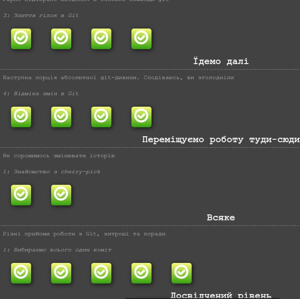
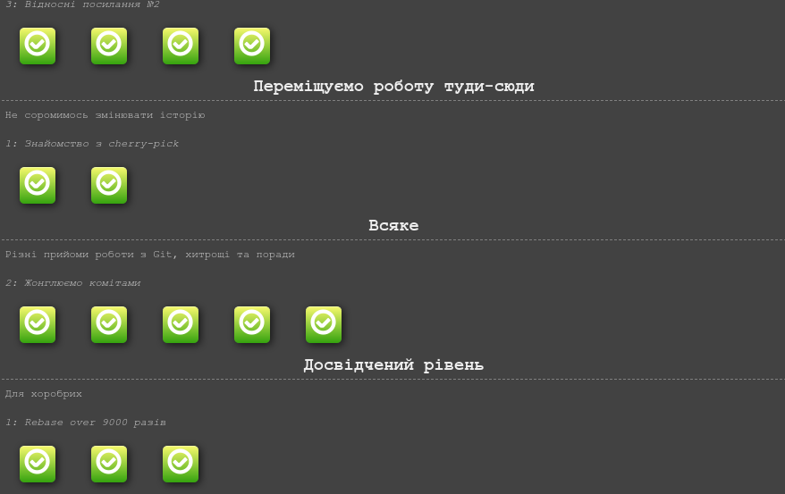
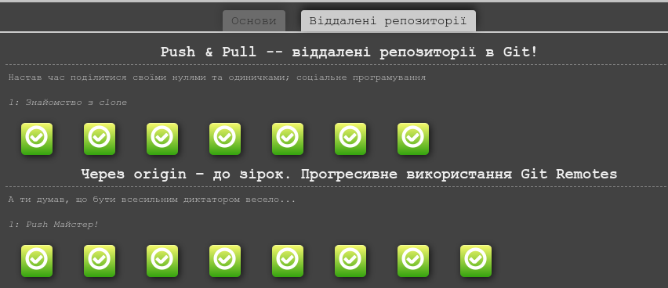
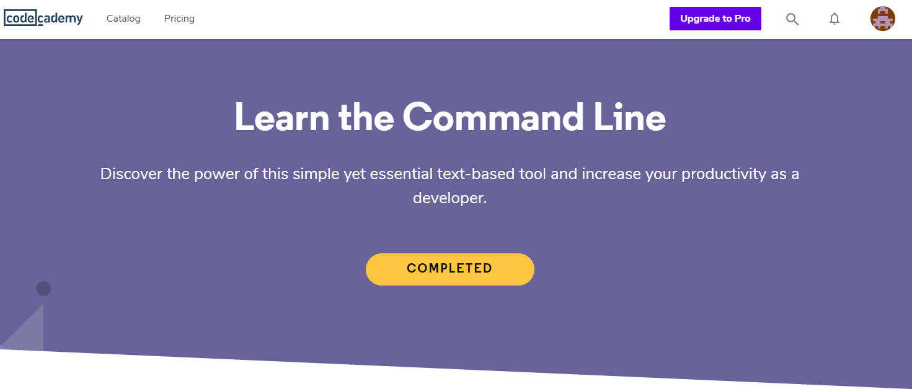
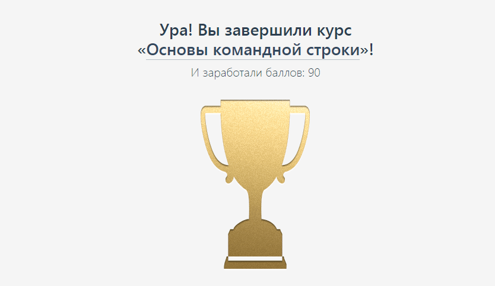

## Git and GitHub -> Task 0

- [x] How to use Git and GitHub
- [x] try.github.io
- [x] Create repository named *kottans-frontend*
- [x] Create README.md for the repository.
- [x] Describe your impressions about learned materials.
- [x] Send a pull-request to Kottans/mock-repo.
- [x] Extra Materials

---
*VCS* - Version Control System.

#### Installing on Linux (Ubuntu OS)

`sudo apt-get install git`

GUI for git -> GitHub Desktop

#### Config base parameters

```
git config --global user.name "My Name"
git config --global user.email myEmail@example.com
```
#### Staging area

Modified files in current version for nex **commit**

#### Branching 

Move to new branch than you working on new *task/feature*. 

### Cheatsheet
---
`git init`

Initialiaze of new git repository.

`git status`

Displays the state of the working directory/staging area.

`git add file_name`

Add modified file to the staging area.

`git add -A` or `git add .`

Add all files to the staging area.

`git commit -m "Commit message"` 

Create commit. *-m* stands for *message*

Add all files to the staging area.

` git checkout -b new_branch_name `

*-b* - stands for creating new branch.

` git branch -d branch_name `

*-d* - stands for deleting branch.

This command deletes only branch, not commits.

` git merge branch1 branch2 ` 

Merge branch2 to branch1.

` git show commit_id `

Compare commit to its parent

`git remote add origin https://remote.repo`

Linking local repo to remote.

`git push`

Upload local changes to remote repo.

`git clone`

Clone remote *repo* to local.

`git pull`

Get changes from remote repository.

`git log`

Show list of all commits

`git diff commit1 commit2`

Show differancy between two commits


### (NEW!) Newline characters between Windows and Unix systems

*Context*: Whenever we hit the "Enter" key on the keyboard, we are actually telling the computer to insert an invisible character into our text file to indicate to the computer that there should be a new line. *Unix* systems adds one character called the "line feed" character or LF or \n while *Windows* systems adds two characters, "carriage return" and "line feed" or CRLF or \r\n.

Solution for merge conflict if you working on Windows.

`git config --global core.autocrlf true`

### (SURPRISED!)

### (USE IN THE FUTURE!)

I'll use in the future Git and GitHub :heart: It's very helpful for monitoring my own projects for any activity.

#### .gitignore

Ignored files are usually build artifacts and machine generated files that can be derived from your repository source or should otherwise not be committed. Some common examples are:

1. dependency caches, such as the contents of /node_modules or /packages
2. compiled code, such as .o, .pyc, and .class files
3. build output directories, such as /bin, /out, or /target
4. files generated at runtime, such as .log, .lock, or .tmp
5. hidden system files, such as .DS_Store or Thumbs.db
6. personal IDE config files, such as .idea/workspace.xml

### Screenshots / Completed courses






## Linux CLI, and HTTP -> Task 1

- [x] Learn the Command Line (Codeacademy)
- [x] HTTP: The Protocol Every Web Developer Must Know - Part 1
- [x] HTTP: The Protocol Every Web Developer Must Know - Part 2
- [x] Describe your impressions about learned materials.
- [ ] Extra Materials
- [ ] Optional

**CLI** - Command Line Interface
**GUI** - Graphic User Interface

**HTTP** stands for Hypertext Transfer Protocol. 
In-depth coverage -> RFC.
HTTP communication takes place over *TCP/IP*. The default port: **80** (Other ports could be used).
Communication between a host and a client occurs, via a **request/response pair**.
**URL** - Uniform resource locator.
```
http://www.domain.com:1234/path/to/resource?a=b&x=y
  |             |       |         |            |
protocol       host    port    resource      query
```
- GET: fetch an existing resource. The URL contains all the necessary information the server needs to locate and return the resource.
- POST: create a new resource. POST requests usually carry a payload that specifies the data for the new resource.
- PUT: update an existing resource. The payload may contain the updated data for the resource.
- DELETE: delete an existing resource.
Request -> URL + VERB (GET, POST, etc.)
Response -> Status Code + Message Body.

Content of response or request:
```
message = <start-line>
          *(<message-header>)
          CRLF
          [<message-body>]

<start-line> = Request-Line | Status-Line 
<message-header> = Field-Name ':' Field-Value
```


### (NEW!) Big amount of different codes.
- 1xx: Informational Messages
- 2xx: Successful
- 3xx: Redirection
- 4xx: Client Error
- 5xx: Server Error
### (SURPRISED!)
Custom headers can also be created and sent by the client; they will be treated as entity headers by the HTTP protocol.
*Everything is a file* describes one of the defining features of Unix.
`*nix` systems also contain:
**Hard Link** — additional name for existing file.
**Symbolic link** — something like label on Windows systems.
**Socket** — internal endpoint for sending or receiving data within a node on a computer network.

### (USE IN THE FUTURE!)
Tools for View HTTP Traffic:
- Chrome/Webkit inspector
- Fiddler (Windows)
- Charles Proxy (OSX)
Command line:
- curl 
- tshark
- tcpdump
### Screenshots / Completed courses



