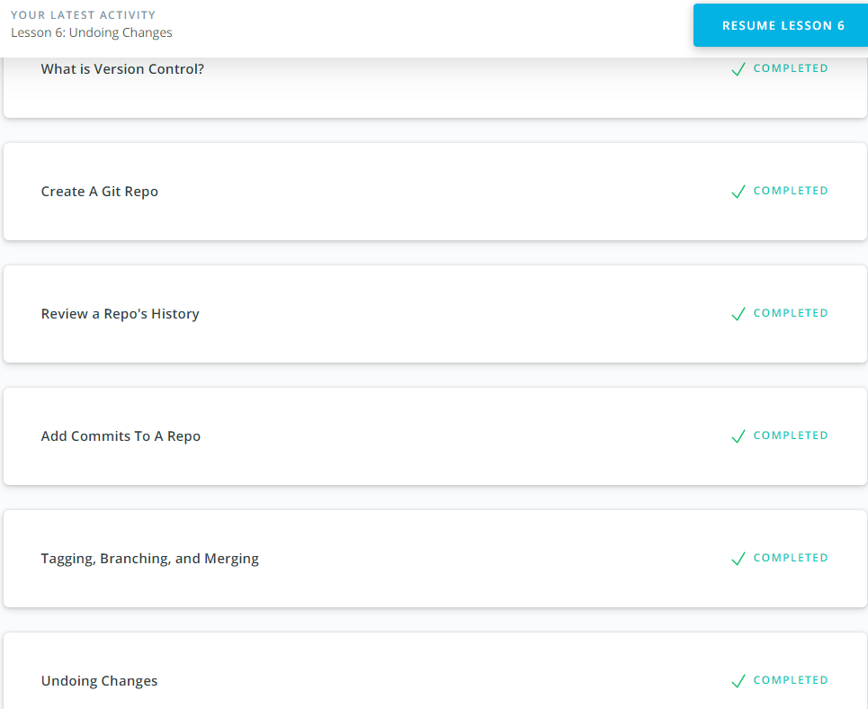
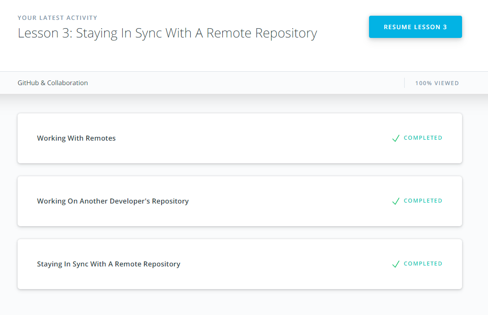

## Git Collaboration

- [x] Version Control with Git (Udacity Course)
- [x] GitHub & Collaboration
- [x] Extra Materials

*Centralized version control* systems are based on the idea that there is a single *“central”* copy of your project somewhere (probably on a server), and programmers will *“commit”* their changes to this central copy.

*Distributed version systems* do not necessarily rely on a central server to store all the versions of a project’s files. Instead, every developer “clones” a copy of a repository and has the full history of the project on their own hard drive. This copy (or “clone”) has all of the metadata of the original.

### (NEW!)

The --oneline flag is used to alter how git log displays information:
`git log --oneline`

The git log command has a flag that can be used to display the files that have been changed in the commit, as well as the number of lines that have been added or deleted. The flag is --stat ("stat" is short for "statistics").
`git log --stat`

The git log command has a flag that can be used to display the actual changes made to a file. The flag is --patch which can be shortened to just -p.
`git log -p`

### (SURPRISED!)

Surprised that we can keep two remotes of forked repository: one for our repository and one for original repository.

### (USE IN THE FUTURE!)

Oh shit, I committed and immediately realized I need to make one small change!

```
# make your change
git add . # or add individual files
git commit --amend --no-edit
# now your last commit contains that change!
# WARNING: never amend public commits
```


### Screenshots / Completed courses


