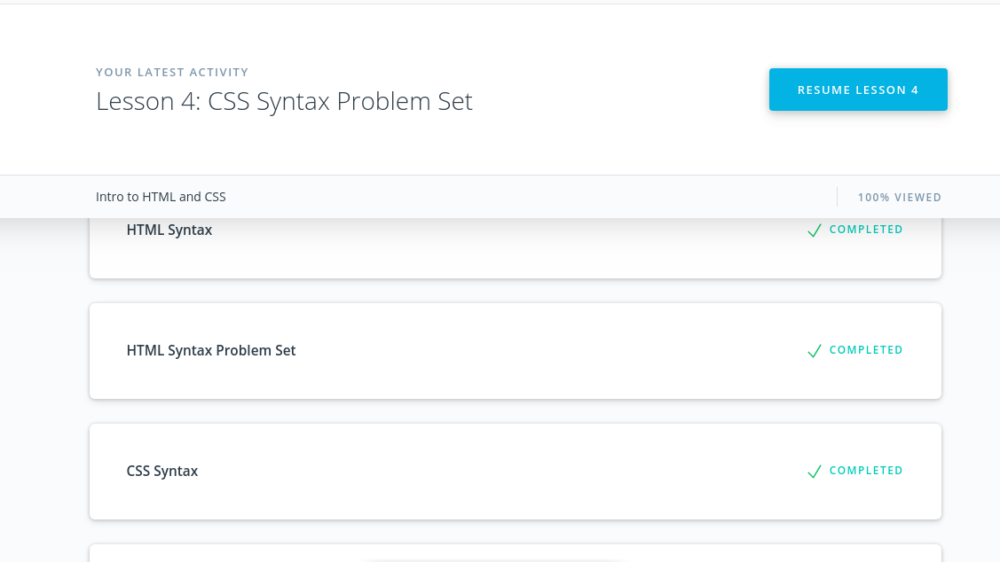
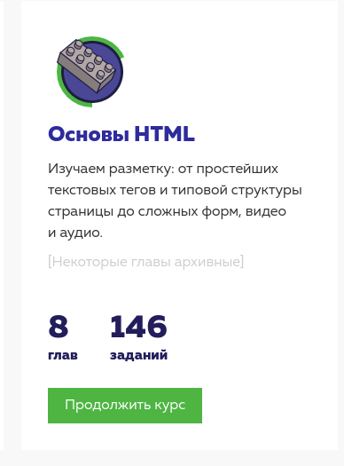

## Intro to HTML & CSS

- [x] Intro to HTML & CSS (Eng)
- [ ] HTML Academy: first two sections, "Basics of HTML" & "Basics of CSS" — free exercises only, you don't have to do paid ones (Rus) 
- [ ] Extra Materials

`<!DOCTYPE html>` is the simplest possible, and the one recommended by HTML5.
`<meta charset="utf-8">` is pretty standard, and will allow your website to display any Unicode character.

### (NEW!)

### (SURPRISED!)

### (USE IN THE FUTURE!)

### Screenshots / Completed courses

